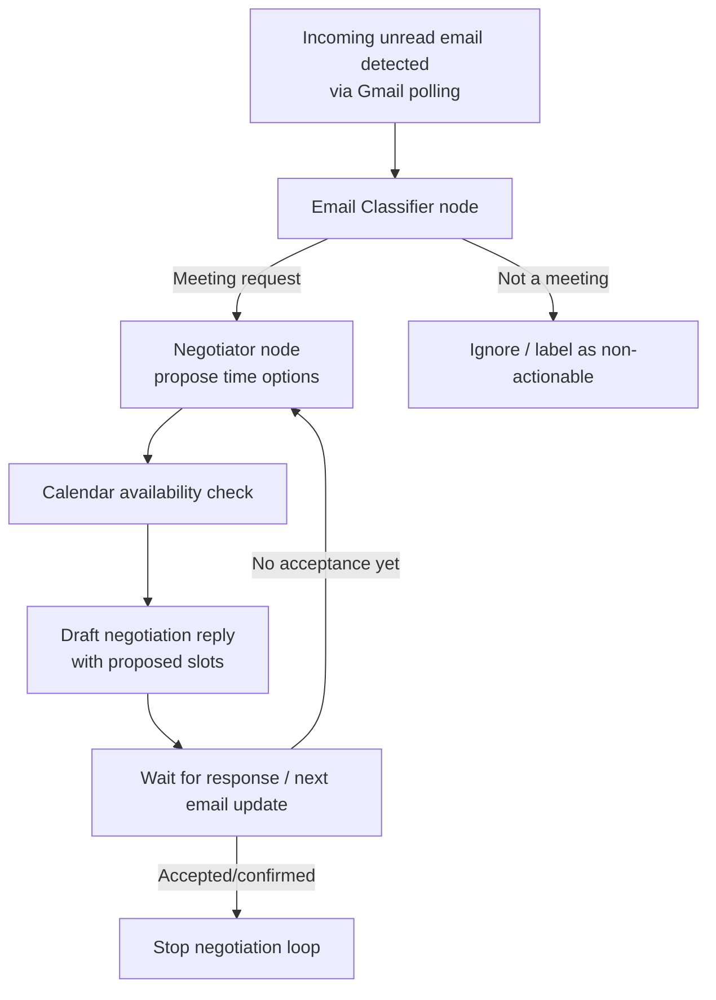

## Project 7: Autonomous Meeting Scheduler & Prep Agent

### Problem Statement
Professionals lose significant time each week to (1) scheduling conflicts (back-and-forth across email/calendar until everyone agrees) and (2) meeting unpreparedness (arriving without enough context about goals, history, and action items). This creates an avoidable productivity bottleneck: meetings consume time twice—first during scheduling, then during inefficient execution.

### MVP Scope (Bounded for Day 1-2)
For the MVP, we will focus on:
1. Detecting meeting request emails in a connected Gmail inbox.
2. Negotiating/confirming an available time by proposing options derived from connected calendar availability (initially via structured proposals; full multi-agent negotiation enhancements come later).
3. Generating a pre-meeting brief from past notes/profiles using a RAG pipeline.
4. Producing a post-meeting summary and action items after meeting content is provided.

Boundaries to keep scope feasible:
- For MVP, meeting audio/transcripts are simulated via uploaded files (e.g., text or audio attachments processed by Whisper later) rather than live VoIP integration.

### Key Features (Planned)
1. **Email intake (Gmail):** detect unread meeting request emails, extract relevant metadata (sender, subject, proposed times, intent).
2. **Calendar availability (Google Calendar):** compute feasible times and propose alternatives.
3. **Asynchronous negotiation loop:** iteratively refine a proposed schedule until the request is accepted/confirmed.
4. **Synchronous prep loop:** generate a pre-meeting brief immediately before the meeting.
5. **Synchronous post loop:** summarize the meeting and extract action items after meeting content is provided.
6. **RAG for history & profiles:** retrieve relevant past meeting notes and participant profiles to inform briefs/summaries.
7. **Dashboard UI (Next.js):** show detected requests, proposed/accepted times, and generated briefs/summaries.

### System Architecture Overview (Dual Pathways)

#### 1) Asynchronous Email/Calendar Negotiation Loop


#### 2) Synchronous Pre/Post-Meeting Extraction Loop
```mermaid
flowchart TD
  P[Meeting confirmed & scheduled] --> Q[Brief Generator node<br/>retrieve context (RAG)]
  Q --> R[Pre-meeting brief]
  R --> S[During/after meeting content is provided<br/>(uploaded transcript/audio)]
  S --> T[Summarizer node<br/>transcript -> summary + action items]
  T --> U[Persist meeting notes + embeddings to DB]
  U --> V[Update participant profiles (optional)]
```

### LangGraph State Graph Architecture (Day 1)
The LangGraph workflow is represented as a stateful graph whose nodes transform a shared `MeetingSchedulerState`.

#### State Object (Conceptual)
`MeetingSchedulerState` contains:
- `incoming_email`: extracted headers/body metadata
- `email_classification`: classification label + confidence + extracted meeting fields
- `negotiation`: proposed time slots, selected slot, and negotiation history
- `calendar_context`: availability windows and calendar IDs used for proposals
- `brief`: generated pre-meeting brief text + citations/retrieval metadata
- `summary`: generated post-meeting summary + action items
- `rag_context`: retrieved documents/chunks from past notes/profiles
- `status`: current workflow state (e.g., `DETECTED`, `CLASSIFIED`, `NEGOTIATING`, `BRIEF_READY`, `SUMMARY_READY`, `DONE`)

#### Nodes to Explicitly Implement
1. **Email Classifier (Node: `classify_email`)**
   - Inputs: `incoming_email`
   - Responsibilities:
     - Determine if email is a meeting request.
     - Extract meeting intent and any time constraints mentioned.
   - Outputs:
     - `email_classification` (label + extracted fields)
     - Update `status`

2. **Negotiator (Node: `negotiate_schedule`)**
   - Inputs: `email_classification`, `calendar_context`
   - Responsibilities:
     - Translate extracted constraints into calendar search queries.
     - Propose feasible time slots.
     - Maintain `negotiation` history.
   - Outputs:
     - Updated `negotiation` with options and (eventually) an accepted time.
     - Set `status` to reflect loop progress.

3. **Brief Generator (Node: `generate_pre_meeting_brief`)**
   - Inputs: `negotiation.selected_slot`, `email_classification`, `rag_context` (via retrieval)
   - Responsibilities:
     - Retrieve relevant past meeting notes and participant profiles (RAG).
     - Generate a concise pre-meeting brief.
   - Outputs:
     - `brief` + retrieval metadata.
     - Set `status` to `BRIEF_READY`.

4. **Summarizer (Node: `summarize_post_meeting`)**
   - Inputs: meeting transcript/audio text, `rag_context` (optional)
   - Responsibilities:
     - Summarize discussion outcomes.
     - Extract action items, owners (if determinable), and deadlines (if present).
   - Outputs:
     - `summary` + action items.
     - Persist notes and update embeddings.
     - Set `status` to `DONE`.

#### Graph Edges (High-Level)
- Start: `classify_email`
- Conditional:
  - If not a meeting request: terminate or mark as `IGNORED`.
  - If meeting request: go to `negotiate_schedule`.
- Loop:
  - `negotiate_schedule` -> (wait/refresh on new email state) -> `negotiate_schedule`
  - Stop condition: `negotiation.accepted == true`
- After acceptance:
  - `generate_pre_meeting_brief` (sync prep loop)
- After meeting content exists:
  - `summarize_post_meeting` (sync post loop)

### Database Schema Outline for the RAG Pipeline
We will use a relational DB (e.g., Postgres) with vector search capability (e.g., `pgvector`).

#### Core Entities
1. **Users / Participants**
   - `participant` table
     - `id` (PK)
     - `email` (unique)
     - `display_name`
     - `created_at`

2. **Meetings**
   - `meeting` table
     - `id` (PK)
     - `external_calendar_event_id` (nullable)
     - `organizer_participant_id` (FK)
     - `start_time` (timestamptz)
     - `end_time` (timestamptz)
     - `subject`
     - `created_at`

3. **Raw Notes / Transcripts**
   - `meeting_note` table
     - `id` (PK)
     - `meeting_id` (FK)
     - `source` (e.g., `email`, `transcript_upload`, `whisper`)
     - `raw_text` (or pointer if large)
     - `created_at`

4. **RAG Documents and Chunks**
   - `document` table (semantic unit; can map 1-1 with meeting_note)
     - `id` (PK)
     - `meeting_note_id` (FK, nullable for profile-only docs)
     - `participant_id` (FK, nullable)
     - `content_type` (e.g., `meeting_history`, `profile_context`)
     - `created_at`

   - `document_chunk` table
     - `id` (PK)
     - `document_id` (FK)
     - `chunk_index`
     - `content` (chunk text)
     - `metadata` (jsonb: speaker, section tags, time ranges, etc.)

5. **Embeddings**
   - `embedding` table
     - `id` (PK)
     - `document_chunk_id` (FK)
     - `embedding_vector` (pgvector type, e.g., `vector(1536)`)
     - `model_name`
     - `created_at`

#### Example RAG Retrieval Flow
- Pre-meeting brief:
  - Retrieve top-k `document_chunk` vectors matching meeting topic + participants.
  - Use citations from retrieved chunks when generating the brief.
- Post-meeting summary:
  - Optionally retrieve related historical context.
  - Persist new transcript/notes and generate embeddings for future recall.

### Assigned Team Roles (Ownership)
1. **Google Workspace Integrations Owner**
   - Owns Google OAuth 2.0 + Gmail + Calendar API setup.
   - Implements polling listener for unread meeting request emails.
   - Implements calendar availability reads and event proposal drafts.

2. **Audio/Whisper Pipeline Owner**
   - Owns audio ingestion (uploaded files for MVP) and Whisper transcription.
   - Provides transcript text to the summarizer node.

3. **LangGraph Orchestration Owner**
   - Owns LangGraph state graph definition, nodes, and loop logic.
   - Integrates node outputs into persisted DB records for RAG.

### Deliverable Summary
By end of Day 1, we will have:
- This project document with explicit problem, bounded MVP scope, feature list, architecture flowcharts, and state graph node mapping.
- Repo scaffolding for `frontend/` (Next.js) and `backend/` (Python).
- SQL schema outline files (or migration placeholders) for the RAG pipeline.

